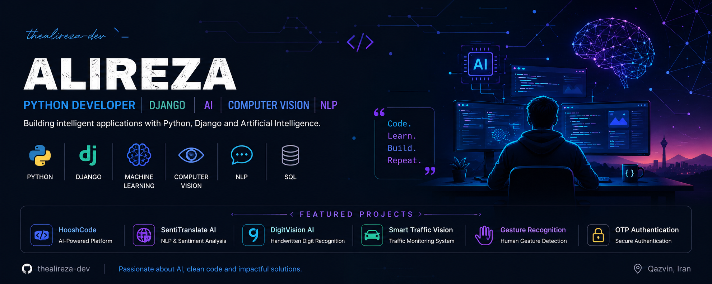

<p align="center">
  
</p>

<h1 align="center">Hi 👋, I'm Alireza</h1>

<h3 align="center">
Python Developer • Django • AI • Computer Vision • NLP
</h3>

<p align="center">
Building intelligent applications with Python, Django and Artificial Intelligence 🚀
</p>

---

## 🧠 About Me

* 🐍 Python Developer
* 🌐 Django Backend Developer
* 🤖 Artificial Intelligence Enthusiast
* 👁️ Computer Vision Developer
* 💬 NLP Practitioner
* 📚 Passionate about building useful software and intelligent systems

---

## ⚔️ The Arsenal (Tech & Tools)

<p align="center">

</p>

---

## 🤖 AI & Machine Learning Lab

<p align="center">

</p>

### Libraries & Frameworks

<p align="center">
OpenCV • Transformers • Scikit-Learn • NumPy • Pandas • Matplotlib
</p>

### Areas of Expertise

* Machine Learning
* Deep Learning
* Computer Vision
* Natural Language Processing
* Generative AI
* Prompt Engineering

---

## 🚀 Current Mission

```txt
Building scalable web applications and intelligent AI-powered solutions.
```

---

## 🏗️ Featured Projects

| Project | Description |
|----------|-------------|
| 🤖 [SubFA AI](https://github.com/thealirezadev/subfa-ai) | Persian AI Subtitle Generation & Speech Processing Platform |
| 🏗️ [HooshCode Bot Suite](https://github.com/thealirezadev/HooshCode-Bot-Suite) | Multi-Bot Ecosystem for Bale Messenger |

---

## 🌌 Currently Exploring

* AI Agents
* Large Language Models (LLMs)
* Multi-Agent Systems
* Advanced Django Patterns
* Scalable Backend Architecture

---

## 📈 Learning Journey

✅ Python

✅ Machine Learning

✅ Deep Learning

✅ Computer Vision

✅ NLP

✅Advanced Django

✅ Software Architecture

✅ Docker & DevOps

---

## 🎯 2026 Goals

* Build impactful AI products
* Contribute to Open Source
* Strengthen Software Engineering skills
* Share knowledge through projects

---

## ☕ Developer Philosophy

```python
while alive:
    learn()
    build()
    improve()
```

---

## 📫 Connect With Me

<p align="left">

💼 LinkedIn: Coming Soon

🌐 Portfolio: Coming Soon

📧 Contact: Available via GitHub

</p>

---

<p align="center">
⚡ Code • Learn • Build • Repeat ⚡
</p>
